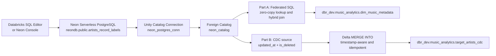

# Lab 10: External Operational Databases, Lakehouse Federation, and CDC

[](https://azure.microsoft.com/products/databricks)
[](https://docs.databricks.com/en/data-governance/unity-catalog/index.html)
[](https://neon.tech/)
[](https://docs.databricks.com/en/query-federation/index.html)

Lab 10 extends the `music_popularity_spike_detection` lakehouse beyond files and managed Delta tables. It integrates a serverless Neon PostgreSQL operational database through two complementary patterns:

1. **Part A: Lakehouse Federation** queries the PostgreSQL lookup dimension in place through a Unity Catalog foreign catalog.
2. **Part B: Change Data Capture (CDC)** synchronizes operational changes into a local Delta table with an idempotent, timestamp-aware `MERGE INTO`.

The lab demonstrates the architectural boundary between live reference access and durable analytical storage. Federation preserves source freshness and avoids an initial copy; CDC creates a governed Delta representation suitable for repeatable analytics, BI, and downstream processing.

## Executive Summary

The external source is Neon PostgreSQL database `neondb`, containing the `public.artists_record_labels` lookup table:

| Column | Meaning |
| --- | --- |
| `artist_id` | Stable operational key |
| `artist_name` | Artist or band name |
| `record_label` | Current record-label relationship |
| `country` | Artist country |
| `contract_signed_year` | Contract start year |
| `updated_at` | Source change-ordering timestamp used by CDC |
| `is_deleted` | Soft-delete marker |

Databricks exposes the source through Unity Catalog as `neon_catalog.public.artists_record_labels`. Part A joins that foreign table directly to the local Delta dimension `dbr_dev.music_analytics.dim_music_metadata`. Part B materializes the source into `dbr_dev.music_analytics.target_artists_cdc` and applies later inserts, updates, and soft deletes without reloading the full table.

This division is deliberate. A small lookup used for an occasional enrichment may be best queried at its source. A table that supports high-concurrency dashboards, repeated aggregations, ML feature generation, or historical audit should generally be synchronized into Delta.

## Architecture



### Local module structure

```text
lab_10_external_operational_databases_lakehouse_federation_cdc/
├── discussion.md  # Design notes on federation, CDC, SCD, and late-arriving data
├── part_A.ipynb    # Neon connection, foreign catalog, hybrid join, and EXPLAIN plans
├── part_B.ipynb    # Delta target initialization and CDC MERGE synchronization
└── README.md       # This architecture and operations guide
```

## Part A: Lakehouse Federation

### 1. Create the external PostgreSQL source

Create the `artists_record_labels` table and its seed data in the Neon SQL Editor. The table is a reference dimension owned by the operational database. The connection account should be a dedicated, read-only technical principal for federation queries.

The source table is surfaced to Databricks with these business columns:

```text
artist_id, artist_name, record_label, country, contract_signed_year
```

Part B adds the CDC metadata columns `updated_at` and `is_deleted` to the same source table.

### 2. Register a Unity Catalog connection

The notebook retrieves the password from a Databricks secret scope before creating the connection object:

```python
password = dbutils.secrets.get(
    "pawelnowak2004pri219_scope",
    "pawel-neon-db-password",
)

spark.sql(f"""
CREATE CONNECTION IF NOT EXISTS neon_postgres_conn
TYPE POSTGRESQL
OPTIONS (
  host 'ep-xyz.aws.neon.tech',
  port '5432',
  user 'neondb_owner',
  password '{password}'
)
""")
```

`CREATE CONNECTION` centralizes the external endpoint and credential reference in a Unity Catalog object. It should be created by a platform administrator and governed independently from analyst query access.

> The host and username above are illustrative values from the lab notebook. Use the actual Neon endpoint and a least-privilege service account in a real deployment.

### 3. Create the foreign catalog

```sql
CREATE FOREIGN CATALOG IF NOT EXISTS neon_catalog
USING CONNECTION neon_postgres_conn
OPTIONS (database 'neondb');
```

Unity Catalog discovers the remote PostgreSQL schema and exposes the table through the three-part name:

```sql
SELECT *
FROM neon_catalog.public.artists_record_labels;
```

No raw copy is created by this query. Databricks plans the read against the external system and returns the result to the SQL execution environment.

### 4. Execute a hybrid zero-copy join

The notebook joins the federated PostgreSQL lookup with the local Delta dimension by normalized artist name:

```sql
SELECT
    ext.artist_name,
    ext.record_label,
    ext.country,
    ext.contract_signed_year,
    loc.title AS track_title,
    loc.album
FROM neon_catalog.public.artists_record_labels AS ext
INNER JOIN dbr_dev.music_analytics.dim_music_metadata AS loc
    ON lower(trim(ext.artist_name)) = lower(trim(loc.author))
ORDER BY ext.contract_signed_year ASC;
```

This is a cross-system analytical query: the lookup remains in Neon while the music metadata remains in Delta. The join is logically unified by Databricks without first materializing the PostgreSQL table in cloud storage.

### 5. Inspect predicate and projection pushdown

```sql
EXPLAIN EXTENDED
SELECT artist_name, record_label
FROM neon_catalog.public.artists_record_labels
WHERE contract_signed_year > 1985;
```

The federated plan should show the external relation receiving the selected columns and filter, represented in the plan as pushed columns and filters. The practical consequence is that PostgreSQL evaluates `contract_signed_year > 1985` and returns only the requested projection where the connector can apply the operation.

For comparison, the notebook inspects a local Delta query:

```sql
EXPLAIN EXTENDED
SELECT author, album
FROM dbr_dev.music_analytics.dim_music_metadata
WHERE author = 'Metallica';
```

The local plan uses Delta transaction-log metadata and file-level data skipping. Pushdown is not a guarantee for every SQL expression or join shape; always inspect the actual plan for the workload and connector version in use.

## Part B: CDC and Incremental Synchronization

### 1. Add source change metadata

The PostgreSQL source is augmented with:

```sql
ALTER TABLE artists_record_labels
    ADD COLUMN IF NOT EXISTS updated_at TIMESTAMP DEFAULT CURRENT_TIMESTAMP,
    ADD COLUMN IF NOT EXISTS is_deleted BOOLEAN DEFAULT FALSE;
```

A row-level PostgreSQL trigger updates `updated_at` whenever an operational update occurs. A production implementation should use a PostgreSQL function and trigger similar to the following:

```sql
CREATE OR REPLACE FUNCTION set_artists_updated_at()
RETURNS TRIGGER AS $$
BEGIN
    NEW.updated_at = CURRENT_TIMESTAMP;
    RETURN NEW;
END;
$$ LANGUAGE plpgsql;

DROP TRIGGER IF EXISTS trg_artists_updated_at ON artists_record_labels;

CREATE TRIGGER trg_artists_updated_at
BEFORE UPDATE ON artists_record_labels
FOR EACH ROW
EXECUTE FUNCTION set_artists_updated_at();
```

The `is_deleted` flag implements a soft-delete contract. The source row remains available for synchronization and audit, while consumers can exclude retired records from current-state views.

### 2. Simulate OLTP changes

Run the following operations atomically in Neon. Use the exact source key for the existing records in the environment; the names below describe the lab scenarios.

```sql
-- INSERT: a newly contracted artist
INSERT INTO artists_record_labels (
    artist_name,
    record_label,
    country,
    contract_signed_year,
    is_deleted
)
VALUES (
    'Led Zeppelin',
    'Atlantic Records',
    'UK',
    1968,
    FALSE
);

-- UPDATE: change the label for an existing artist
UPDATE artists_record_labels
SET record_label = 'Warner Records / Machine Shop'
WHERE artist_name = 'Linkin Park';

-- SOFT DELETE: retire the operational contract without removing the row
UPDATE artists_record_labels
SET is_deleted = TRUE
WHERE artist_name = 'Nirvana';
```

The trigger updates `updated_at` for both update statements. In a production CDC source, the key should be immutable and the update timestamp should be generated by the source system rather than supplied by clients.

### 3. Initialize the Delta target

The target keeps the current source state plus synchronization metadata:

```sql
CREATE TABLE IF NOT EXISTS dbr_dev.music_analytics.target_artists_cdc (
    artist_id INT,
    artist_name STRING,
    record_label STRING,
    country STRING,
    contract_signed_year INT,
    updated_at TIMESTAMP,
    is_deleted BOOLEAN,
    _synced_at TIMESTAMP
);

INSERT OVERWRITE dbr_dev.music_analytics.target_artists_cdc
SELECT
    artist_id,
    artist_name,
    record_label,
    country,
    contract_signed_year,
    updated_at,
    is_deleted,
    current_timestamp() AS _synced_at
FROM neon_catalog.public.artists_record_labels;
```

Initialization is a one-time baseline operation. Subsequent runs should use the merge below rather than repeating a full overwrite.

### 4. Apply idempotent incremental synchronization

```sql
MERGE INTO dbr_dev.music_analytics.target_artists_cdc AS target
USING neon_catalog.public.artists_record_labels AS source
ON target.artist_id = source.artist_id

WHEN MATCHED AND source.is_deleted = TRUE THEN
  UPDATE SET
    target.is_deleted = TRUE,
    target.updated_at = source.updated_at,
    target._synced_at = current_timestamp()

WHEN MATCHED AND source.updated_at > target.updated_at THEN
  UPDATE SET
    target.artist_name = source.artist_name,
    target.record_label = source.record_label,
    target.country = source.country,
    target.contract_signed_year = source.contract_signed_year,
    target.updated_at = source.updated_at,
    target.is_deleted = source.is_deleted,
    target._synced_at = current_timestamp()

WHEN NOT MATCHED AND source.is_deleted = FALSE THEN
  INSERT (
    artist_id,
    artist_name,
    record_label,
    country,
    contract_signed_year,
    updated_at,
    is_deleted,
    _synced_at
  )
  VALUES (
    source.artist_id,
    source.artist_name,
    source.record_label,
    source.country,
    source.contract_signed_year,
    source.updated_at,
    source.is_deleted,
    current_timestamp()
  );
```

The merge has three deliberate behaviors:

- **Soft deletes:** A matched row with `source.is_deleted = TRUE` is retained but marked deleted in Delta.
- **Newer updates:** A matched row is overwritten only when the source timestamp is newer than the target timestamp.
- **New records:** A non-deleted source row with no target key is inserted.

Running the same merge repeatedly is idempotent for unchanged source rows: the update branch is skipped when `source.updated_at` is not greater than `target.updated_at`, and the insert branch cannot match an existing `artist_id`.

### 5. Verify synchronized state

```sql
SELECT
    artist_id,
    artist_name,
    record_label,
    is_deleted,
    updated_at,
    _synced_at
FROM dbr_dev.music_analytics.target_artists_cdc
ORDER BY artist_id;
```

The expected state transitions are:

| Scenario | Expected Delta state |
| --- | --- |
| `Led Zeppelin` inserted | New row with `is_deleted = FALSE` and a populated `_synced_at` |
| `Linkin Park` updated | Existing row has `record_label = 'Warner Records / Machine Shop'` and a newer `updated_at` |
| `Nirvana` soft-deleted | Existing row remains present with `is_deleted = TRUE` |
| Re-running the merge | No stale overwrite and no duplicate `artist_id` rows |

The notebook does not hard-code row counts because the source seed data is environment-specific. Verification should assert keys, values, deletion flags, and timestamp ordering rather than relying only on total row count.

## Engineering Analysis

### Federation versus ingestion

| Dimension | Lakehouse Federation | Ingestion into Delta |
| --- | --- | --- |
| Data movement | No initial copy; data remains in PostgreSQL | Data is copied into cloud storage and managed Delta tables |
| Freshness | Near real time for each query | Depends on batch, micro-batch, or streaming schedule |
| Analytical throughput | Limited by source CPU, connection pool, network, and connector pushdown | Benefits from Spark parallelism, Delta statistics, caching, and data skipping |
| OLTP impact | Queries can consume PostgreSQL CPU, connections, and I/O | Workload is shifted to ingestion compute after synchronization |
| Storage | Minimal lakehouse footprint | Additional Delta storage, history, and checkpoints |
| Governance | Unity Catalog governs access to the foreign object; source account still needs least privilege | Delta permissions, lineage, retention, and quality controls apply locally |
| Best fit | Small lookups, ad-hoc analysis, compliance-sensitive data that should not be copied | Heavy aggregations, high-concurrency BI, ML features, repeated joins, and durable snapshots |

Query in place when the source is small, freshness is more important than scan throughput, and the operational database can tolerate the workload. Ingest to Delta when the workload is repeated or expensive, when consumers need predictable performance, or when the platform requires durable history and independent scaling.

Federation is not a substitute for source protection. A dashboard that generates many concurrent federated queries can still overload the operational database even when each individual query is efficient.

### Full batch versus CDC

A full reload reads and writes the complete table on every run. It is simple and useful for initial bootstrap or periodic reconciliation, but its cost grows with table size. Repeated reloads consume network bandwidth, increase source pressure, duplicate storage activity, and extend recovery windows.

CDC transfers only rows that changed since the previous synchronization boundary. It reduces network and compute volume and supports smaller micro-batches. It requires a reliable change contract: stable keys, source ordering metadata, delete semantics, replay behavior, monitoring, and a strategy for missed changes or retention gaps.

The Lab 10 pattern uses the federated table as the current CDC source and `updated_at` plus `is_deleted` as the minimum change contract. A production implementation may use PostgreSQL logical replication, Debezium, a managed CDC service, or an append-only change table when polling the current source table is not sufficient.

### SCD Type 1 versus SCD Type 2

The implemented Delta merge is an **SCD Type 1** pattern. A matching `artist_id` is overwritten with the latest accepted values. It keeps the current state compact and makes downstream joins simple, but it does not preserve the previous record-label value as a queryable historical version.

An **SCD Type 2** model preserves history by closing the current row and inserting a new version, typically with:

```text
valid_from TIMESTAMP
valid_to   TIMESTAMP
is_current BOOLEAN
```

Type 2 is appropriate when reports must answer historical questions such as which label was active when a popularity event occurred. It increases cardinality and requires point-in-time join logic. The existing lakehouse already uses SCD Type 2 concepts for selected music metadata histories; the external artist dimension can adopt the same approach if audit requirements exceed current-state reporting.

### Late-arriving and out-of-order data

Network retries, asynchronous delivery, and source-side concurrency can cause an older event to arrive after a newer update. The predicate:

```sql
WHEN MATCHED AND source.updated_at > target.updated_at THEN UPDATE
```

prevents an older payload from replacing newer committed state. The comparison must use a trustworthy source-generated timestamp or a stronger source sequence number. Production hardening should also address:

- Equal timestamps, which may require a tie-breaker such as a source event ID or version.
- Clock skew, which makes database-generated timestamps preferable to application clocks.
- Missing or null timestamps, which should be rejected or quarantined rather than treated as newest.
- Deletes that arrive after later updates, which require an explicit source ordering policy.
- Reconciliation, which should periodically compare source and target keys, versions, and deletion flags.

## Security, Governance, and Production Hardening

### Credential anti-pattern: interpolated passwords

The notebook obtains the password from `dbutils.secrets.get()`, which is materially better than committing a password to source control. However, interpolating the secret into a SQL string still deserves careful treatment: SQL command history, diagnostic output, permissions on connection creation, and accidental logging must be controlled.

Never use this anti-pattern:

```sql
CREATE CONNECTION neon_postgres_conn
TYPE POSTGRESQL
OPTIONS (password 'plain-text-password');
```

The enterprise pattern is:

1. Store the Neon credential in Azure Key Vault.
2. Expose it through a Databricks-backed secret scope.
3. Grant only the deployment identity or connection administrator access to the secret.
4. Create the Unity Catalog connection using a secret reference where supported by the workspace and connector syntax:

```sql
CREATE CONNECTION neon_postgres_conn
TYPE POSTGRESQL
OPTIONS (
  host 'ep-xyz.aws.neon.tech',
  port '5432',
  user 'neondb_reader',
  password secret('neon-prod-scope', 'postgres-password')
);
```

Validate the exact `secret()` support and syntax for the deployed Azure Databricks runtime and PostgreSQL connection type before production rollout. Do not expose the secret value to notebooks, logs, query results, or ordinary analysts.

### Unity Catalog governance

The connection and foreign catalog should be owned by a controlled platform group. Grant access at the narrowest useful scope:

```sql
GRANT USE CATALOG ON CATALOG neon_catalog TO `data_engineers`;
GRANT USE SCHEMA ON SCHEMA neon_catalog.public TO `data_engineers`;
GRANT SELECT ON TABLE neon_catalog.public.artists_record_labels TO `data_engineers`;
```

Exact principal syntax and permission inheritance depend on the workspace identity model. The important boundary is that analysts receive Unity Catalog permissions rather than direct Neon credentials. The underlying technical account should be read-only for Part A and should not be reused for application writes.

Additional production controls should include:

- Private network connectivity or approved egress controls between Databricks and Neon.
- TLS certificate validation and endpoint allow-listing.
- Source query monitoring, connection-pool limits, and workload isolation.
- Catalog and table lineage review for federated and materialized paths.
- Audit logs for connection changes, grants, queries, and Delta writes.
- Data quality checks for null keys, invalid timestamps, duplicate keys, and unexpected delete rates.
- A replay and reconciliation procedure for missed CDC intervals.
- Delta history, retention, and recovery policies aligned with the source system's audit requirements.

## Verification and Run Guide

### Prerequisites

- An Azure Databricks workspace with Unity Catalog enabled.
- A Neon PostgreSQL serverless project and the `neondb` database.
- Network connectivity from Databricks to the Neon endpoint.
- A PostgreSQL service account with only the required privileges.
- A Databricks secret scope backed by Azure Key Vault for the source password.
- Existing local table `dbr_dev.music_analytics.dim_music_metadata` for the Part A hybrid join.
- Permission to create or use the Unity Catalog connection, foreign catalog, and Delta target table.

### Run Part A in Databricks SQL Editor

1. Open `part_A.ipynb` in the Databricks workspace or copy its SQL cells into a SQL editor.
2. Configure the secret scope and key used by the connection creation cell.
3. Execute the `CREATE CONNECTION` cell once as an authorized platform user.
4. Execute the `CREATE FOREIGN CATALOG` statement.
5. Run the direct `SELECT` against `neon_catalog.public.artists_record_labels`.
6. Run the hybrid join against `dbr_dev.music_analytics.dim_music_metadata`.
7. Run both `EXPLAIN EXTENDED` statements and inspect pushed filters, pushed columns, remote scans, and local Delta data skipping.

### Run Part B in Neon and Databricks

1. In the Neon Console, add `updated_at` and `is_deleted` and create the `trg_artists_updated_at` trigger.
2. Execute the INSERT, label UPDATE, and Nirvana soft-delete scenarios in a transaction where appropriate.
3. In Databricks SQL Editor, create and baseline `dbr_dev.music_analytics.target_artists_cdc`.
4. Execute the complete `MERGE INTO` statement from this README or `part_B.ipynb`.
5. Run the verification query and confirm the three expected state transitions.
6. Execute the merge again and confirm that it does not create duplicate keys or apply stale updates.
7. Review Delta history and source timestamps when validating replay or out-of-order behavior.

### Files

- [Part A notebook](part_A.ipynb)
- [Part B notebook](part_B.ipynb)
- [Architecture discussion](discussion.md)
