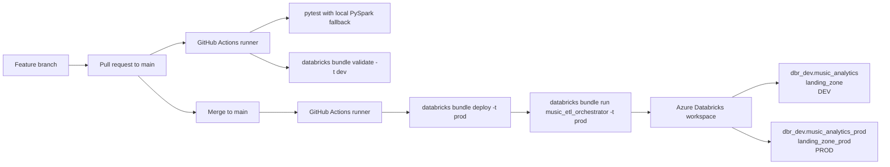
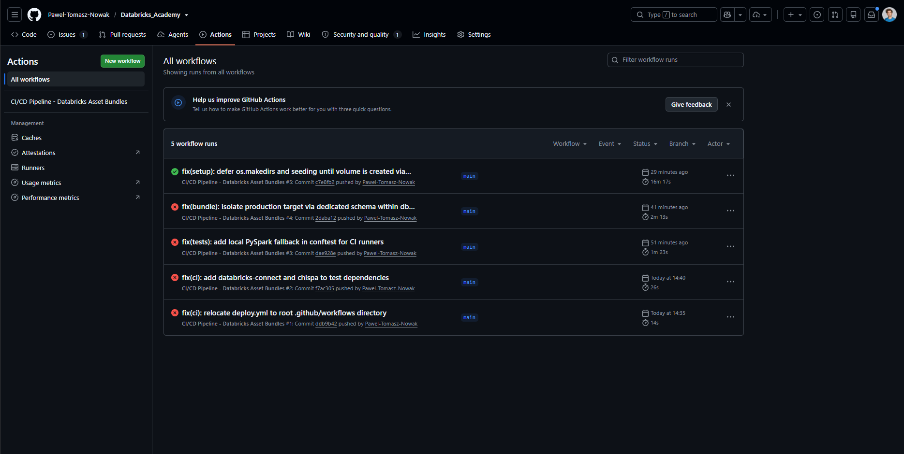
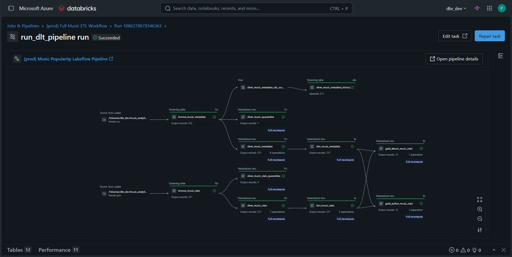

# Lab 8: CI/CD Dev-to-Prod Promotion for the YouTube Music Lakehouse

[](../../actions)
[](https://www.databricks.com/product/azure)
[](https://docs.databricks.com/en/dev-tools/bundles/index.html)
[](https://docs.github.com/en/actions)

## Executive Summary

Lab 8 operationalizes the `music_popularity_spike_detection` YouTube Music
Popularity Lakehouse with Databricks Asset Bundles (DABs) and GitHub Actions.
The workflow moves deployment responsibility from manual workspace actions to a
repeatable promotion path:

1. A pull request targeting `main` runs focused PySpark unit tests and validates
   the DEV bundle.
2. A merge to `main` deploys the same bundle to the PROD target.
3. The workflow starts `music_etl_orchestrator` in PROD and lets Databricks
   execute the configured setup, ingestion, Lakeflow pipeline, and
   reconciliation tasks.

The implementation preserves environment separation without requiring a second
Unity Catalog catalog. The shared metastore could not create `dbr_prod` because
its storage root was unavailable, so DEV and PROD use dedicated schemas in the
existing `dbr_dev` catalog.

## Architecture and Environment Topology



### Target Comparison

| Capability | DEV | PROD |
| --- | --- | --- |
| DAB target | `dev` | `prod` |
| Catalog | `dbr_dev` | `dbr_dev` |
| Schema | `music_analytics` | `music_analytics_prod` |
| Landing volume | `landing_zone` | `landing_zone_prod` |
| Pipeline mode | `pipelines_development: true` | `pipelines_development: false` |
| Triggers | Paused (`PAUSED`) | Unpaused (`UNPAUSED`) |
| Pipeline target | `dbr_dev.music_analytics` | `dbr_dev.music_analytics_prod` |
| Compute | Existing cluster `0702-132442-toro5spu`; Lakeflow single-node `Standard_D4ds_v5`, 1 worker | Same configured compute, resolved through the PROD target variables |
| Promotion intent | Validation and development runs | Deployed and executed automatically after merge |

The bundle sets `presets.name_prefix: ''` for both targets. This keeps resource
names stable and readable while the schema, volume, pipeline target, and trigger
state provide the environment boundary.

## Repository Structure

```text
lab_8_ci_cd_dev_prod_promotion/
├── databricks.yml                         # Bundle name, variables, targets, and presets
├── resources/
│   └── jobs_dlt.yml                        # Lakeflow pipeline and four-task orchestrator
├── src/
│   ├── pipelines/                          # Bronze, silver, fact, dimension, and gold layers
│   ├── producer/                            # YouTube API extraction and snapshot writing
│   ├── quality/                             # Post-pipeline reconciliation gate
│   ├── setup/                               # UC bootstrap and idempotent metadata seeding
│   └── transformations/                     # Reusable PySpark business transformations
├── tests/
│   ├── conftest.py                          # Databricks Connect or local PySpark fixture
│   ├── test_aggregate_stats.py              # Author and album aggregation tests
│   └── test_aggregate_video_stats.py        # Video-level projection tests
├── data/seed/                               # Reference metadata CSV files
├── BI/                                      # Dashboards, alerts, CLS, and RLS assets
├── exploration/notebooks/                   # Supporting analysis notebooks
├── screenshots/                             # Deployment and production execution evidence
└── README.md                                # This document
```

## CI/CD Pipeline Implementation

The workflow is defined in the repository-level
`.github/workflows/deploy.yml` file. It uses the Databricks CLI and authenticates
through GitHub Actions secrets rather than storing credentials in source code.

### CI: Pull Requests to `main`

The `validate_and_test` job runs on `ubuntu-latest` with Python 3.11:

1. Checks out the repository.
2. Installs `pytest`, `pyspark`, and `chispa`.
3. Runs the focused transformation suite from the Lab 8 directory:
   `test_aggregate_stats.py` and `test_aggregate_video_stats.py`.
4. Installs the Databricks CLI.
5. Executes `databricks bundle validate -t dev` with
   `DATABRICKS_HOST` and `DATABRICKS_TOKEN` supplied by GitHub Secrets.

The CI gate is intentionally lightweight. It validates Python behavior and
bundle resolution without starting the production workflow or writing to the
PROD schema.

### CD: Push or Merge to `main`

The `deploy_to_prod` job requires CI to pass and is restricted to a push event
on `main`. It performs two operations in order:

```bash
databricks bundle deploy -t prod
databricks bundle run music_etl_orchestrator -t prod
```

The orchestrator in `resources/jobs_dlt.yml` executes these dependent tasks:

1. `setup_environment` creates or verifies the target schema and volume and
   seeds reference metadata.
2. `fetch_youtube_data` writes a timestamped YouTube snapshot to the target
   landing volume.
3. `run_dlt_pipeline` executes the Lakeflow pipeline across the medallion layers.
4. `reconciliation_gate` checks post-pipeline counts and aggregate consistency.

### Credentials and Secret Handling

The workflow expects the following GitHub repository secrets:

| Secret | Purpose |
| --- | --- |
| `DATABRICKS_HOST` | Azure Databricks workspace URL |
| `DATABRICKS_TOKEN` | Databricks CLI authentication token |
| Databricks secret scope configured in the bundle | YouTube API key lookup at runtime |

The bundle passes the configured secret scope and key names to Databricks tasks;
the API key value remains in the Databricks secret scope. No token or API key
should be committed to YAML, notebooks, tests, or workflow logs.

### Headless PySpark Fallback

`tests/conftest.py` first attempts to create a `DatabricksSession`, which is
convenient for local development against an active Databricks cluster. If
Databricks Connect is unavailable, the fixture falls back to a single-threaded
local `SparkSession` configured with one shuffle partition and one level of
parallelism.

This keeps CI fast and avoids installing the heavier `databricks-connect`
package in GitHub-hosted runners. The selected unit tests operate on in-memory
DataFrames and therefore do not require a remote workspace for their assertions.

## Engineering Challenges and Solutions

### 1. Unity Catalog Metastore Storage Root

**Constraint:** Creating a new `dbr_prod` catalog failed with
`INVALID_STATE: Metastore storage root URL does not exist`.

**Solution:** The bundle uses schema-level isolation inside the existing catalog:

```text
dbr_dev.music_analytics       + landing_zone       = DEV
dbr_dev.music_analytics_prod  + landing_zone_prod  = PROD
```

This retains independent table namespaces and landing volumes while avoiding a
new catalog that the shared metastore cannot provision. The target-specific
variables in `databricks.yml` ensure every pipeline and task resolves to the
correct schema.

### 2. Unity Catalog Volume Filesystem Error

**Constraint:** Calling filesystem operations before Unity Catalog registration
caused FUSE `Errno 95: Operation not supported` errors.

**Solution:** `src/setup/music_pipeline_setup.py` registers the schema and volume
with SQL before touching `/Volumes`:

```python
spark.sql(f"CREATE SCHEMA IF NOT EXISTS {catalog_name}.{music_schema}")
spark.sql(f"CREATE VOLUME IF NOT EXISTS {catalog_name}.{music_schema}.{volume_name}")
```

Only after registration does the setup task create the landing directory and
copy seed files. The seeding operation is idempotent and skips files already
present in the target volume.

### 3. Bundle Runtime Path Resolution

Lakeflow runtime imports do not always provide `__file__`. The setup module's
`get_bundle_root()` resolves the bundle root from the task argument, `__file__`
when available, or the runtime working directory. This allows the same seeding
logic to run from a bundle task and from a Databricks pipeline context.

## Verification and Proof of Deployment

The committed screenshots provide visual evidence for the two release stages:

### GitHub Actions CI/CD Run

The green workflow run shows the validation gate followed by the production
deployment and orchestration jobs.



### Production Lakeflow Execution

The completed production graph shows the orchestrated Lakeflow execution after
the PROD bundle deployment.



For an operational verification, confirm all of the following in the Databricks
workspace after a release:

- the PROD pipeline resolves to `dbr_dev.music_analytics_prod`;
- the landing volume is `landing_zone_prod`;
- the orchestrator tasks complete in dependency order;
- the reconciliation gate succeeds after the Lakeflow pipeline;
- PROD pipeline triggers remain enabled while DEV triggers remain paused.

## How to Run and Validate Locally

Run commands from the Lab 8 directory. A configured Databricks CLI profile or
`DATABRICKS_HOST` and `DATABRICKS_TOKEN` environment variables are required for
bundle validation and deployment.

### Validate Both Bundle Targets

```bash
cd lab_8_ci_cd_dev_prod_promotion

databricks bundle validate -t dev
databricks bundle validate -t prod
```

### Run the Local Unit Tests

```bash
cd lab_8_ci_cd_dev_prod_promotion
python -m pip install --upgrade pip
python -m pip install pytest pyspark chispa
pytest tests/test_aggregate_stats.py tests/test_aggregate_video_stats.py -v
```

The tests use Databricks Connect when it is installed and configured; otherwise
they use the local PySpark fallback described above.

### Run the Production Promotion Commands

These commands mirror the CD job and should be used only when the caller is
authorized to deploy to the shared Databricks workspace:

```bash
cd lab_8_ci_cd_dev_prod_promotion
databricks bundle deploy -t prod
databricks bundle run music_etl_orchestrator -t prod
```

## Key Configuration Files

| File | Responsibility |
| --- | --- |
| [`databricks.yml`](databricks.yml) | Bundle identity, variables, DEV/PROD targets, and presets |
| [`resources/jobs_dlt.yml`](resources/jobs_dlt.yml) | Lakeflow pipeline definition and orchestrator DAG |
| [`src/setup/music_pipeline_setup.py`](src/setup/music_pipeline_setup.py) | UC registration, path resolution, and seed loading |
| [`tests/conftest.py`](tests/conftest.py) | Remote Databricks Connect and local PySpark session selection |
| [`.github/workflows/deploy.yml`](../.github/workflows/deploy.yml) | Pull-request CI and post-merge PROD promotion |
